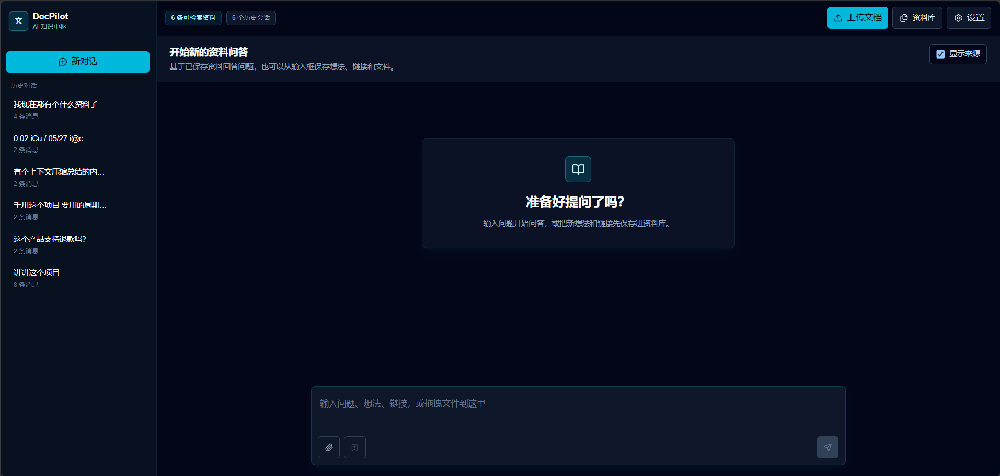
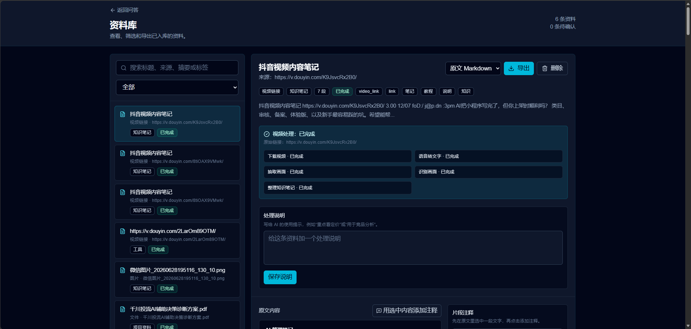
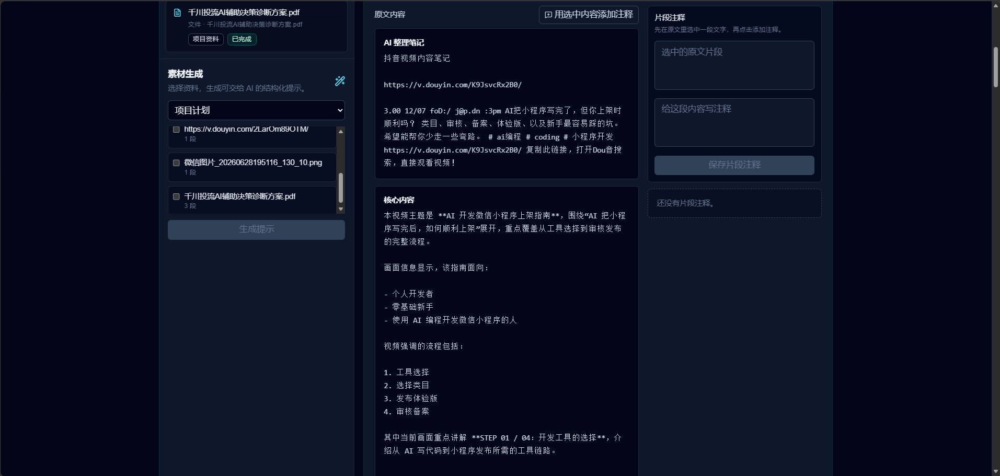
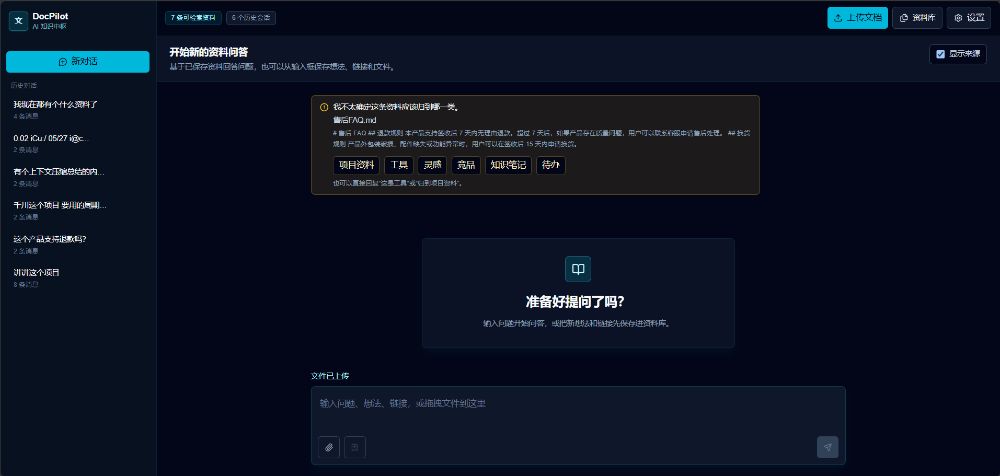
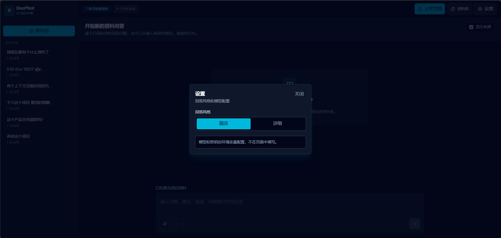

# DocPilot Demo：本地优先的 AI 知识库助手

[English README](README.en.md)

DocPilot Demo 是一个面向个人资料整理和作品集展示的 AI 知识库助手。它可以把文档、网页链接、图片、随手记录和视频链接放进同一个资料库，再围绕这些资料做问答、溯源、标注和素材整理。

这个项目不是一个只停留在聊天框里的 RAG demo。它更像一个小型资料工作台：资料先入库，系统会解析内容、切片、分类和保存来源；提问时会带着引用回答；后续还可以回到资料库里查看原文、补充说明、添加片段注释，或者把选中的资料生成可交给 AI 继续处理的提示词。



## 这个 demo 展示什么

- **资料入库**：支持 Markdown、PDF、Office、CSV、HTML、图片和网页链接。默认用本地 JSON 保存，不需要先搭数据库。
- **资料问答**：围绕已入库内容提问，回答会带来源片段，方便检查依据。
- **资料库管理**：可以搜索、筛选、查看原文、导出、删除，也可以给资料补处理说明。
- **片段标注**：在原文里选一段内容，为它添加注释，适合做调研和项目复盘。
- **视频链接处理**：配置下载器和 `ffmpeg` 后，可以把抖音视频链接整理成可检索的知识笔记。
- **分类确认**：系统不确定资料属于哪一类时，会把判断权交还给用户。
- **素材生成**：选中资料后，可以生成项目计划、功能清单、竞品分析等结构化提示词。
- **历史对话**：支持查看、恢复、重命名和删除历史会话。

## 页面预览

### 资料库与视频处理

资料库页面可以看到每条资料的来源、类型、状态和处理结果。视频类资料会展示处理进度，比如下载视频、语音转文字、抽取画面、识别画面和整理知识笔记。



### 原文、注释与素材生成

资料详情里保留原文内容，右侧可以给片段添加注释。左侧素材生成区可以选中多条资料，生成一段更适合继续交给 AI 使用的结构化提示。



### 分类确认和设置

当系统不确定资料应该归到哪一类时，会在工作台里提示用户确认。设置弹窗目前保持克制，只放回答风格等必要选项，模型和密钥继续走环境变量。





## 技术栈

- Next.js 16、React 19、TypeScript
- Tailwind CSS
- OpenAI SDK，支持 Responses API 和 Chat Completions
- 本地 JSON 数据库，默认路径是 `data/local-db.json`
- 可选 Supabase/PostgreSQL + pgvector
- `pdf-parse`、`mammoth`、`jszip`、`cheerio`
- Vitest、Playwright

## 快速启动

需要 Node.js 20.9 或更高版本。

```bash
npm install
cp .env.example .env.local
npm run dev
```

然后打开：

```text
http://localhost:3000
```

使用 AI 问答、图片理解、查询规划或视频总结前，需要在 `.env.local` 里填写 `OPENAI_API_KEY`。

```dotenv
DATABASE_PROVIDER=local
LOCAL_DB_PATH=data/local-db.json
OPENAI_API_KEY=
OPENAI_BASE_URL=
OPENAI_WIRE_API=responses
OPENAI_DISABLE_RESPONSE_STORAGE=true
OPENAI_CHAT_MODEL=gpt-4o-mini
# 可选，仅推理模型需要：none, minimal, low, medium, high, xhigh
# OPENAI_REASONING_EFFORT=medium
OPENAI_EMBEDDING_MODEL=local-hash-embedding-v1
RAG_MATCH_THRESHOLD=0.78
RAG_MATCH_COUNT=5
RAG_AI_QUERY_PLANNING=true
VIDEO_PROCESSING_ENABLED=true
VIDEO_AUDIO_TRANSCRIPTION_MODEL=gpt-4o-mini-transcribe
VIDEO_FRAME_INTERVAL_SECONDS=8
VIDEO_MAX_FRAMES=8
VIDEO_FFMPEG_PATH=ffmpeg
DOUYIN_VIDEO_COMMAND_TIMEOUT_MS=180000
```

`OPENAI_BASE_URL` 是可选项。使用官方 OpenAI 服务时可以留空；如果使用 OpenAI-compatible 网关，再填入对应地址。默认的 `local-hash-embedding-v1` 是本地兜底 embedding，文档入库时不会额外调用云端 embedding。

## 推荐演示流程

1. 启动应用，进入 DocPilot 工作台。
2. 上传 `docs/demo/售后FAQ.md`。
3. 等资料状态变成“已完成”。
4. 提问：`这个产品支持退款吗？`
5. 展开回答里的来源，检查它引用的原文片段。
6. 打开资料库，试一下搜索、标注、导出和素材生成。
7. 回到工作台，在左侧历史栏里重命名或删除对话。

如果要演示视频链接，需要先准备下载器和 `ffmpeg`：

```dotenv
DOUYIN_VIDEO_COMMAND=node
DOUYIN_VIDEO_COMMAND_ARGS=["scripts/download-douyin.js","{url}","{outputDir}"]
```

运行时会把 `{url}` 和 `{outputDir}` 替换成视频链接和临时输出目录。

## 目录结构

```text
src/app/                 Next.js 页面和 API 路由
src/components/          工作台和资料库 UI
src/lib/ai/              OpenAI-compatible 调用、embedding、图片/视频辅助能力
src/lib/chat/            问答流程编排
src/lib/db/              本地 JSON 和 Supabase 仓库
src/lib/knowledge/       文件解析、入库、分类、导出、注释
src/lib/rag/             检索、引用、回答策略、查询规划
src/lib/video/           视频下载、转写、抽帧和诊断
docs/demo/               本地演示用的示例资料
docs/images/             README 使用的界面截图
supabase/migrations/     可选 Supabase 数据库结构
tests/                   单元、服务和端到端测试
```

## 常用命令

```bash
npm run lint
npm run test
npm run build
npm run test:e2e
npm run verify
```

`npm run verify` 会依次运行 lint、单元/服务测试和生产构建。Playwright 端到端测试单独运行，因为新机器上可能需要先安装浏览器。

## 可选：Supabase 模式

本地 JSON 是推荐的 demo 模式。如果要测试 Supabase，可以把 `.env.local` 改成：

```dotenv
DATABASE_PROVIDER=supabase
SUPABASE_URL=
SUPABASE_SERVICE_ROLE_KEY=
```

然后应用迁移文件：

```text
supabase/migrations/202606290001_initial_schema.sql
```

## 提交和隐私

- `.env.local`、`data/`、`.next/`、`node_modules/`、`output/` 和测试报告都已加入 `.gitignore`。
- 本地数据库默认生成在 `data/local-db.json`，不要提交。
- 不要提交真实 API Key 或私人资料。
- `docs/demo/` 里的文件是合成示例资料，适合公开 demo。

## 已知限制

- 扫描版 PDF 暂不支持 OCR，只支持能提取文本的 PDF。
- 本地 hash embedding 是 MVP 兜底方案，不是真正的语义向量模型。
- Supabase 支持是可选能力，新资料管理功能优先以本地模式验证。
- 视频链接处理依赖外部下载器、`ffmpeg` 和转写配置，失败时需要看资料库里的诊断提示。
